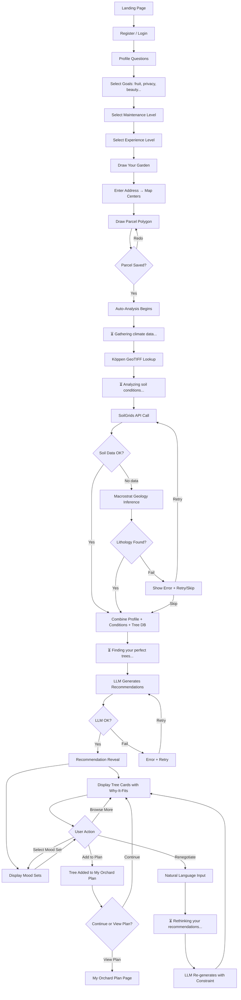
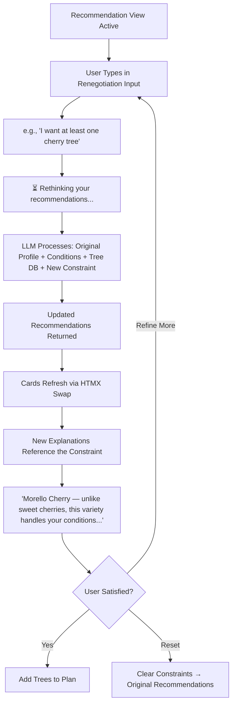
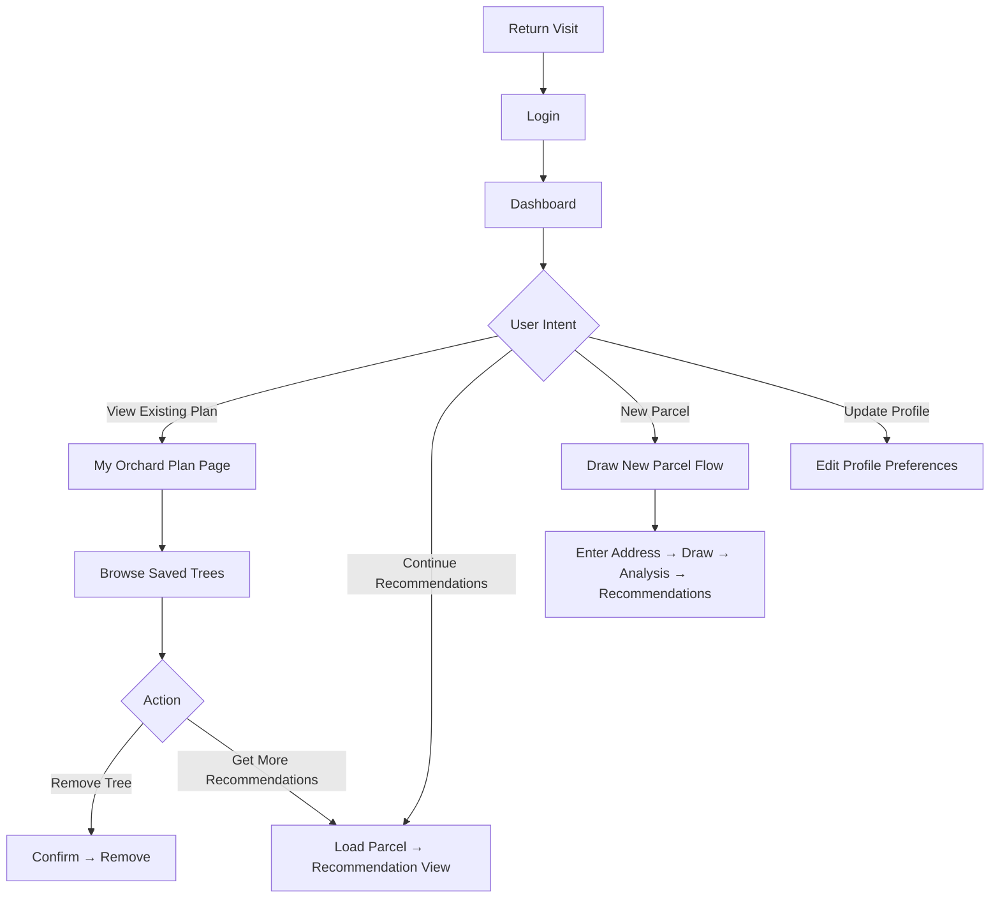
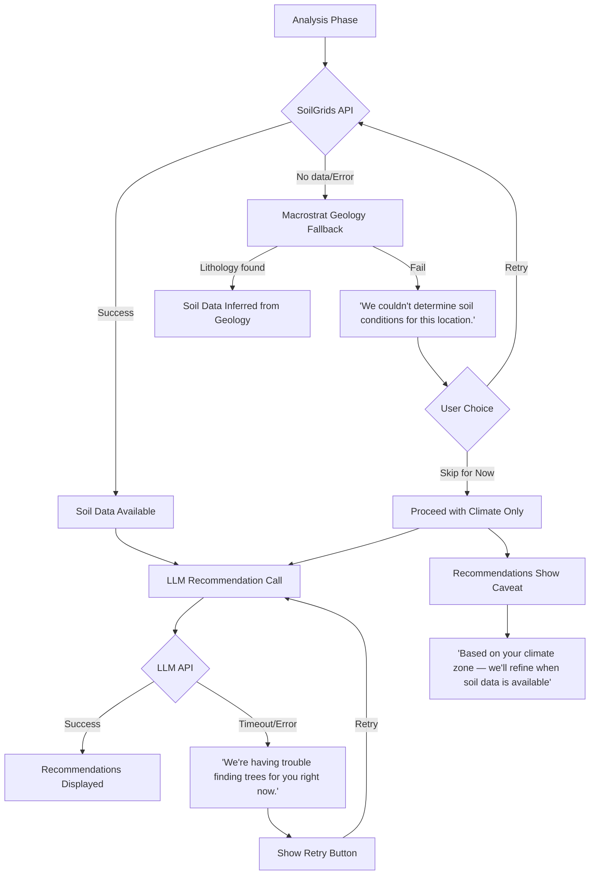

# UX Design Specification tree_manager_app

**Author:** Cedric
**Date:** 2026-01-28

---

## Executive Summary

### Project Vision

Tree Manager App is an intelligent tree planning tool that transforms the overwhelming process of choosing trees into a confident, guided experience. The core UX mission is confidence transfer — not just providing data, but giving users permission to act by explaining *why* each recommendation fits their specific conditions. Built on Django + HTMX + Leaflet with an LLM recommendation engine, the product targets European growers and emphasizes authoritative data presented through empathetic, human-readable explanations.

### Target Users

**Primary: The Weekend Orchardist**
Enthusiastic beginners (25-50) with land, budget, and dreams — but paralyzed by uncertainty. They've consumed contradictory information and need a single trustworthy source that says "plant these, here's why." Their core fear is wasting money and years on trees that die. Tech comfort is moderate; they expect modern web experiences but aren't power users. Desktop-first usage, likely researching at home in planning mode.

**Secondary: The Permaculture Enthusiast**
Higher knowledge level, values data quality and European specificity. Uses the tool as a reference rather than a guided journey. Appreciates depth and transparency in the underlying data. Less emotional need for reassurance, more need for comprehensive information.

### Key Design Challenges

1. **User profiling before map interaction:** A profiling questionnaire (goals, preferences, experience level) precedes parcel drawing. This warms users into the flow with easy, familiar interactions before the more complex map step, while also collecting context that enriches downstream recommendations.
2. **Map interaction accessibility:** Polygon drawing on satellite imagery must feel approachable to non-technical users. The profiling step eases the transition, but the drawing UX itself still needs clear guidance and forgiveness (easy redo/edit).
3. **LLM latency management:** A simple "Thinking..." indicator during the 2-10 second recommendation generation. No over-engineering needed — users understand thinking states.
4. **Choice architecture:** 200 species with multiple filter dimensions risks recreating the overwhelm users came here to escape. Progressive filtering and curated entry points are essential.
5. **Progressive disclosure:** Balancing beginner simplicity with expert depth across the same interface without cluttering or hiding critical information.

### Design Opportunities

1. **The recommendation reveal:** The moment filtered results appear — personalized, explained, trustworthy — is the product's emotional peak. Designing this moment for maximum impact drives retention and word-of-mouth.
2. **Mood-based discovery as onboarding:** Curated sets ("Low-effort abundance," "Privacy fortress") bypass filter fatigue and speak users' emotional language, not botanical language.
3. **Conversational renegotiation:** Natural language refinement ("I want at least one cherry tree") transforms the tool from a database query into a trusted advisor relationship.

## Core User Experience

### Defining Experience

The core experience is the **recommendation cycle**: users provide their context (profile + parcel), the system analyzes their conditions silently, and delivers personalized tree recommendations with natural-language explanations. Everything before the reveal is setup; everything after is exploration and commitment. The defining interaction is the moment curated results appear — personalized, explained, trustworthy.

The updated core loop: **Register → Profile Questions → Draw Parcel → Auto-Analyze → Recommendations → Renegotiate → Save Plan**

### Platform Strategy

- **Platform:** Web application (Django + HTMX + Tailwind CSS)
- **Map layer:** Leaflet + leaflet-draw for parcel polygon interaction
- **Rendering:** Server-rendered Django templates with HTMX partial swaps for dynamic updates
- **Responsive:** Desktop-first design, mobile-viewable
- **Browsers:** Modern only (Chrome, Firefox, Safari, Edge — last 2 versions)
- **JavaScript:** Minimal — only for Leaflet map interactions; all other interactivity via HTMX
- **Offline:** Not required
- **SEO:** Not required

### Effortless Interactions

1. **Location analysis is invisible:** Climate zone detection and soil analysis happen automatically after parcel drawing — zero user action required
2. **Profiling feels conversational:** Goal and preference questions presented as friendly choices, not a form to fill out
3. **Mood sets bypass configuration:** "Low-effort abundance" delivers instant curated results without touching a single filter
4. **Renegotiation is plain language:** Users type what they want naturally; the system interprets and adapts
5. **"Thinking..." loading state:** Simple, honest indicator during LLM processing — no progress bars or fake steps

### Critical Success Moments

| Moment | User Feeling | Design Priority |
|--------|-------------|-----------------|
| Profile complete | "That was easy, they get what I want" | High — sets emotional tone |
| Parcel analyzed | "It knows MY land" — system feels intelligent | High — first trust deposit |
| Recommendation reveal | "These trees are for ME" — the aha moment | Critical — the product's reason to exist |
| Renegotiation response | "It actually listens" — advisor, not database | High — deepens trust relationship |
| Plan saved | "I have a plan" — shift from browsing to committing | Medium — conversion moment |

### Experience Principles

1. **Confidence over information:** Every screen builds trust, not cognitive load. We are a trusted advisor, not a database UI.
2. **Progressive commitment:** Easy questions first (profile), then bigger ask (draw parcel), then reward (recommendations). Each step earns the next.
3. **Explain, don't display:** Data is woven into natural language. "This plum thrives in your climate and tolerates your soil" — not raw compatibility scores.
4. **Simplicity as default, depth on demand:** Beginners see curated results and mood sets. Enthusiasts can access parcel profiles and detailed species data when they want it.

## Desired Emotional Response

### Primary Emotional Goals

1. **Relief:** "Finally, someone just tells me what works." The end of analysis paralysis — the system synthesizes complexity so users don't have to.
2. **Confidence:** "I trust this enough to spend money." The permission to act — every recommendation is backed by transparent reasoning.
3. **Pride:** "I did it right from the start." The lasting satisfaction of making informed, successful planting decisions.

### Emotional Journey Mapping

| Stage | Desired Emotion | Design Trigger |
|-------|----------------|----------------|
| First visit | Curiosity + hope | Clean, focused messaging that mirrors their problem back to them |
| Profile questions | Ease + feeling understood | Warm, conversational question flow — not a clinical form |
| Drawing parcel | Engagement + personal investment | "I'm showing it MY garden" — satellite view makes it real |
| Analysis complete | Impressed + trust | System reveals knowledge about their land they didn't have |
| Recommendation reveal | Relief + confidence | Curated, explained, personalized — the core emotional payoff |
| Renegotiation | Heard + empowered | System adapts to their words — they're in control |
| Plan saved | Pride + commitment | Personal workspace signals "this is your plan, you made it" |
| Error states | Patience, not frustration | Honest, human language — "We couldn't reach our soil data. Try again later." |
| Return visit | Welcome + continuity | Plan persists, ready to pick up where they left off |

### Micro-Emotions

**Critical emotional axis:** Confidence vs. Confusion — every interaction must resolve toward certainty.

| Positive Target | Negative to Avoid | Mechanism |
|----------------|-------------------|-----------|
| Confidence | Confusion | Plain-language explanations for every recommendation |
| Trust | Skepticism | Transparent reasoning — "this fits because..." |
| Accomplishment | Frustration | Progressive flow with clear progress and easy recovery |
| Delight | Overwhelm | Curated sets and pre-filtered results reduce cognitive load |
| Feeling understood | Incompetence | Human language throughout — no jargon, no raw data tables |

### Design Implications

1. **Pre-filtered results for relief:** Users never see trees that won't work on their land. The system removes bad options before display.
2. **"Why it fits" for confidence:** Every recommended tree includes a natural-language explanation connecting the user's conditions to the tree's requirements.
3. **"My Orchard Plan" for pride:** The workspace frames saved trees as a personal achievement and commitment, not a shopping cart.
4. **Conversational profiling for warmth:** Profile questions use friendly, human language. Mood sets speak in emotional goals ("Low-effort abundance"), not botanical categories.
5. **Honest errors for trust preservation:** API failures get clear, empathetic messages. No jargon, no generic "something went wrong," no blame on the user.

### Emotional Design Principles

1. **Every screen should reduce anxiety, never add it.** If a user feels more uncertain after an interaction than before, the design has failed.
2. **Explain like a knowledgeable friend, not a textbook.** The tone is warm expertise — confident but approachable.
3. **Celebrate small wins.** Completing profile, drawing parcel, getting results — each step deserves acknowledgment.
4. **Errors are trust tests.** How the product handles failure defines the relationship more than how it handles success.

## UX Pattern Analysis & Inspiration

### Inspiring Products Analysis

**Airbnb — Map-Based Discovery**
Map as spatial anchor with progressive disclosure. Users search an area, see results as cards alongside the map, and drill into details on demand. Filters feel like gentle refinement rather than complex configuration. The dual map+list view keeps users spatially oriented while browsing options.

**Spotify — Mood-Based Curation**
"Made for You" playlists create emotional ownership through personalization. Mood and vibe categories (Chill, Focus, Energy) bypass technical genre taxonomy and speak in user intent. Discovery feels effortless — users explore rather than configure. The system's taste-matching feels intelligent without requiring user effort.

**Foodvisor — Profile-First Onboarding**
Conversational profiling questionnaire gathers goals, constraints, and preferences upfront. Recommendations adapt to the user's specific profile. Educational content is delivered in micro-doses — teaching just enough to inform decisions without overwhelming. The profile creates a "the system knows me" foundation that makes all subsequent recommendations feel earned.

### Transferable UX Patterns

| Pattern | Source | Application in Tree Manager |
|---------|--------|---------------------------|
| Map + list dual view | Airbnb | Parcel displayed on map with recommendation cards alongside |
| Progressive card → detail | Airbnb | Species card preview → expandable/full detail view |
| Mood/vibe categories | Spotify | Mood-based discovery sets as primary entry point for beginners |
| "Made for you" framing | Spotify | Personal ownership language — "Trees for your garden" |
| Profile-first onboarding | Foodvisor | Conversational profiling before parcel drawing warms users in and builds context |
| Educational micro-doses | Foodvisor | Brief "did you know" insights woven into recommendation explanations |
| Lightweight progressive filters | Airbnb | Preference refinement as narrowing, not a configuration wall |

### Anti-Patterns to Avoid

1. **Filter wall:** Presenting all filter dimensions simultaneously overwhelms beginners. Progressive refinement over upfront configuration.
2. **Raw data dump:** Showing pH values, Köppen codes, and drainage scores as tables. Translate data into meaning through natural language.
3. **Generic recommendations:** Results without personal context ("popular trees in Europe") destroy trust. Every result must connect to the user's specific conditions.
4. **Education overload:** Resist teaching everything about tree care before users have chosen a tree. Micro-doses of knowledge at the moment of relevance.
5. **Complexity before value:** Minimize barriers between arrival and the first useful result. Keep the profiling conversational and lightweight.

### Design Inspiration Strategy

**Adopt directly:**
- Map + card dual layout for the recommendation view (Airbnb pattern)
- Mood-based discovery sets as the default entry point (Spotify pattern)
- Profile-first onboarding flow with conversational tone (Foodvisor pattern)

**Adapt for our context:**
- Airbnb's filter system → simplified to 2-3 preference dimensions visible at once, with mood sets as the primary alternative
- Foodvisor's educational approach → "Did you know your soil is ideal for stone fruit?" woven into recommendation explanations, not as separate educational content
- Spotify's personalization language → "Recommended for your garden" framing on all results

**Avoid deliberately:**
- Complex filter UIs with many simultaneous dimensions
- Data-forward presentation (tables, scores, codes)
- Generic content that doesn't reference the user's specific conditions
- Long educational content that delays the core recommendation experience

## Design System Foundation

### Design System Choice

**DaisyUI** — a Tailwind CSS component library that provides semantic component classes on top of Tailwind's utility-first foundation.

### Rationale for Selection

1. **Stack alignment:** Pure CSS classes — no JavaScript framework dependency. Works natively with Django server-rendered templates and HTMX partial swaps.
2. **Developer efficiency:** Semantic component classes (`btn`, `card`, `modal`, `form-control`) dramatically reduce the Tailwind utility class composition burden for a solo developer with limited frontend experience.
3. **Built-in theming:** Pre-built themes provide a polished starting point. Theme customization available when brand differentiation becomes a priority.
4. **Tailwind escape hatch:** DaisyUI layers on top of Tailwind — raw utility classes remain available for custom layouts, the Leaflet map container, and any component DaisyUI doesn't cover.
5. **Low learning curve:** Designed for developers who want good-looking UI without deep CSS/design expertise.

### Implementation Approach

- Install DaisyUI as a Tailwind plugin (`npm install daisyui`)
- Select a base theme that aligns with a nature/garden aesthetic (e.g., `garden`, `emerald`, or a custom theme)
- Use DaisyUI component classes in Django templates for all standard UI elements (buttons, cards, forms, navigation, modals)
- Use raw Tailwind utilities for layout, spacing, and custom elements (map container, recommendation reveal)
- HTMX attributes applied directly to DaisyUI-styled elements — no conflicts

### Customization Strategy

- **Phase 1 (MVP):** Use a DaisyUI built-in theme with minor color adjustments. Focus on shipping, not pixel-perfecting.
- **Phase 2 (Polish):** Define a custom DaisyUI theme with brand colors, typography, and component radius/spacing tuned to the nature/garden aesthetic.
- **Custom components:** Species cards, mood set selectors, and the recommendation reveal will need custom styling beyond DaisyUI defaults — built with raw Tailwind utilities on top of DaisyUI layout primitives.

## Defining Core Experience

### Defining Experience

**"Show it your garden, and it tells you exactly what trees will thrive there — and why."**

This is the one-sentence experience users describe to friends. The defining interaction is the recommendation reveal: the moment personalized, explained tree recommendations appear after the user has simply drawn their garden and answered a few questions. Everything before builds toward this moment; everything after deepens it.

### User Mental Model

Users arrive with a simple question: "What trees will work on MY land?" Their current mental model is research-based — YouTube, forums, nursery staff — which is scattered, contradictory, and slow. Tree Manager shifts the model from "I need to research" to "I describe my situation, and it tells me." The system behaves like a knowledgeable friend who happens to know the user's exact soil and climate conditions.

**Key expectation:** The system should feel like asking an expert, not querying a database.

### Success Criteria

| Criteria | Observable Indicator |
|----------|---------------------|
| "This just works" | Draw parcel → recommendations appear with no confusion about next step |
| User feels smart | Explanations teach *why* each tree fits — users learn without studying |
| Speed | Profile + parcel + first recommendations in under 3 minutes of user effort |
| Automatic intelligence | Climate + soil analysis happens invisibly — user never handles raw data |
| Trust | Explanations reference the user's specific conditions, not generic advice |

### Novel UX Patterns

Each individual interaction uses established, familiar patterns — no user education required:
- Profile questionnaire (health/fitness apps)
- Map polygon drawing (Airbnb, real estate, Google Maps)
- Card-based recommendations (Spotify, Netflix)
- Natural language input (search bars, chat interfaces)

The **novel combination** is the full loop: profile + drawn parcel + invisible environmental analysis + LLM-synthesized recommendations with conversational renegotiation. No existing product chains these together. Users understand each step intuitively; the innovation is in the synthesis.

### Experience Mechanics

**Step 1 — Profile Questions (Initiation)**
- Trigger: Post-registration → "Let's find trees for your garden"
- Format: Card-based selection (DaisyUI cards) — tap goals, preferences, experience level
- Tone: Friendly intake conversation, not a clinical form
- Output: User profile stored for recommendation context

**Step 2 — Parcel Drawing (Initiation)**
- Trigger: Profile complete → "Now show us your garden"
- Format: Satellite map (Leaflet) centered on address with polygon drawing tool
- Guidance: Clear instruction + undo/redo + visual feedback on drawn area
- Output: Polygon coordinates + calculated area

**Step 3 — Environmental Analysis (Invisible Processing)**
- Trigger: Automatic on parcel save — no user action
- Processing: Köppen GeoTIFF lookup + SoilGrids API call
- Feedback: "Thinking..." indicator
- Optional: "View parcel profile" link for curious users (progressive disclosure)
- Output: Unified location profile (climate zone + soil pH + drainage + area)

**Step 4 — Recommendation Reveal (Core Payoff)**
- Trigger: Analysis complete → recommendations generated by LLM
- Format: Tree cards with name, image, and natural-language "why it fits" explanation
- Alternative entry: Mood-based discovery sets for instant curated results
- Summary: "14 trees match your garden" — count signals comprehensiveness
- Emotional target: Relief + confidence — "these are MY trees"

**Step 5 — Renegotiation (Deepening)**
- Trigger: User types natural language constraint in text input
- Processing: LLM re-generates with constraint → "Thinking..."
- Format: Updated card list with adapted explanations
- Emotional target: "It actually listens" — advisor relationship

**Step 6 — Save to Plan (Commitment)**
- Trigger: User adds trees via action on card
- Destination: "My Orchard Plan" workspace — separate page
- Content: Selected trees with characteristics, spacing needs, fit explanations
- Emotional target: Pride + commitment — "I have a real plan"

## Visual Design Foundation

### Color System

**Palette Philosophy:** Earth tones with forest green authority. Warm, natural, confident — not clinical or whimsical. European understated elegance.

| Role | Color | Hex | Usage |
|------|-------|-----|-------|
| Primary | Forest green | `#2D6A4F` | Primary buttons, key actions, nav accent |
| Primary focus | Deep green | `#1B4332` | Hover states, active elements |
| Secondary | Warm amber | `#D4A373` | Secondary actions, mood set cards, warmth accents |
| Accent | Soft sage | `#95D5B2` | Success states, compatibility indicators, "this fits" signals |
| Neutral light | Warm cream | `#F5F0EB` | Page backgrounds, card backgrounds |
| Neutral dark | Charcoal | `#2D3436` | Body text, headings |
| Error | Terracotta | `#C1666B` | Errors, incompatibility warnings |
| Info | Sky blue | `#5B9BD5` | Informational tooltips, educational micro-doses |

**DaisyUI Integration:** Custom theme extending the `garden` base theme with the palette above. Configured in `tailwind.config.js` under `daisyui.themes`.

### Typography System

| Element | Font | Size | Weight | Line Height |
|---------|------|------|--------|-------------|
| H1 | Inter | `text-4xl` (36px) | Bold (700) | 1.2 |
| H2 | Inter | `text-2xl` (24px) | Semibold (600) | 1.25 |
| H3 | Inter | `text-xl` (20px) | Semibold (600) | 1.3 |
| Body | Inter | `text-base` (16px) | Regular (400) | 1.6 |
| Small/Caption | Inter | `text-sm` (14px) | Regular (400) | 1.5 |
| Button | Inter | `text-sm` (14px) | Medium (500) | 1.0 |

**Rationale:** Single font family (Inter) — excellent screen readability, free via Google Fonts, zero font-pairing complexity. Generous body line height (1.6) supports the airy, anxiety-reducing aesthetic.

### Spacing & Layout Foundation

**Base Unit:** 4px (Tailwind default scale)

**Density:** Spacious — generous whitespace reduces cognitive load and supports the calm, confident emotional goal.

| Element | Spacing | Tailwind Class |
|---------|---------|---------------|
| Content max width | 1280px | `max-w-7xl` |
| Section padding | 48-64px | `py-12` to `py-16` |
| Card gaps | 16-24px | `gap-4` to `gap-6` |
| Component padding | 16-24px | `p-4` to `p-6` |
| Border radius | 8px | `rounded-lg` |

**Layout Strategy:**
- Flexbox for card grids (tree cards, mood sets)
- CSS Grid for map + recommendation list dual layout
- No rigid column system — responsive flex/grid as needed
- Desktop-first breakpoints with mobile-viewable fallback

### Accessibility Considerations

- **Contrast:** All text meets WCAG AA minimum (4.5:1 for body text, 3:1 for large text) against chosen backgrounds
- **Font sizing:** 16px base prevents mobile zoom issues
- **Color not sole indicator:** Compatibility signals use text + color (not color alone)
- **Focus states:** Visible focus rings on all interactive elements (DaisyUI default)
- **No formal WCAG target for MVP** (per PRD) — but baseline accessibility through sensible defaults

## Design Direction Decision

### Design Directions Explored

Six design directions were generated and evaluated via interactive HTML showcase (`ux-design-directions.html`):

1. **Clean Stacked Flow** — Full-width vertical sections, guided wizard feel
2. **Map + Cards Split** — Airbnb-inspired dual layout, spatial browsing
3. **Mood-First Discovery** — Spotify-inspired emotional entry point
4. **Progressive Single Page** — HTMX-native progressive revelation
5. **Dashboard + Sidebar** — App-like persistent navigation
6. **Card-Heavy Minimal** — Content-forward large tree cards

### Chosen Direction

**Composite approach** — combining the strongest elements from multiple directions into a cohesive, minimalist experience:

| Flow Stage | Direction Source | Pattern |
|------------|----------------|---------|
| Profiling / onboarding | Direction 1 (Stacked Flow) | Full-width, centered card-based goal selection |
| Core flow structure | Direction 4 (Progressive Single Page) | Single page with HTMX partial reveals as user progresses |
| Recommendation view | Direction 2 (Map + Cards) | Split layout — parcel map + scrollable recommendation cards |
| Mood set entry | Direction 3 (Mood-First) | Prominent mood cards as primary discovery alternative |
| Tree card design | Direction 6 (Card Minimal) | Large cards with "why it fits" explanation blocks and tags |
| Return user / plan view | Direction 5 (Dashboard) | Structured overview of parcels, plans, and saved trees |

### Design Rationale

1. **Minimalist but informative:** Every element earns its place. No decorative clutter — information density is carefully managed to inform without overwhelming.
2. **User-appropriate complexity:** First-time users see a guided, progressive flow. Return users see a structured dashboard. Same product, different entry points.
3. **HTMX-native architecture:** The progressive single-page pattern (Direction 4) maps directly to HTMX partial swaps — each section loads as the previous completes, with no full page reloads.
4. **Content is the design:** Tree cards with prominent "why it fits" explanations (Direction 6) make the LLM-generated content the visual star, not chrome or decoration.
5. **Emotional entry points:** Mood sets (Direction 3) provide instant, curated discovery without requiring filter configuration — the Spotify-inspired shortcut for beginners.

### Implementation Approach

- **Single-page core flow** (profile → parcel → analysis → recommendations) using HTMX `hx-target` swaps on a single Django view
- **Split layout** (CSS Grid) activates for the recommendation phase — map left, cards right
- **DaisyUI components** for all standard UI (buttons, forms, navigation, modals)
- **Custom card components** for tree cards and mood sets — Tailwind utilities on top of DaisyUI primitives
- **Separate plan page** (`/plan/`) with dashboard layout for return users
- **Progressive disclosure** via HTMX — sections appear as previous steps complete, scroll position managed naturally

## User Journey Flows

### Journey 1: First-Time User — Complete Happy Path

**Scope:** Registration through first saved plan — Sophie's full story.

**Progressive waiting messages:**

| Backend Phase | User Sees | Duration |
|--------------|-----------|----------|
| Köppen GeoTIFF lookup | "Gathering climate data..." | <500ms |
| SoilGrids API call | "Analyzing soil conditions..." | 1-5s |
| LLM recommendation generation | "Finding your perfect trees..." | 2-10s |
| LLM renegotiation | "Rethinking your recommendations..." | 2-10s |

**Key design decisions:**
- Profile → Parcel → Analysis → LLM → Reveal is strictly sequential (progressive single page, HTMX swaps)
- Climate and soil analysis shown as distinct user-visible phases with contextual messages
- LLM receives: user profile + environmental conditions + tree database → outputs ranked selections with explanations
- SoilGrids failure allows "skip for now" — climate-only recommendations with visible caveat
- LLM failure gets retry only — no fallback (LLM is core to the product value)

### Journey 2: Renegotiation Flow

**Scope:** Refining recommendations with natural language constraints.

**Key design decisions:**
- Renegotiation input always visible below recommendation cards — persistent, no extra clicks
- Constraints are additive — each refines further, with a "reset" escape
- Updated explanations explicitly reference the user's constraint — proof the system listened
- HTMX partial swap replaces only the card list, not the whole page

### Journey 3: Return User

**Scope:** Existing user returning to continue or manage plans.

**Key design decisions:**
- Dashboard shows parcels, plans, and saved tree count at a glance
- Quick paths to the most common return actions
- No forced re-profiling — preferences persist, editable on demand

### Journey 4: Error Recovery

**Scope:** Handling SoilGrids and LLM API failures gracefully.

**Key design decisions:**
- SoilGrids failure: user can retry or skip — partial results with caveat better than no results
- LLM failure: retry only — no partial fallback (LLM is core to the product)
- All error messages use human language, no technical jargon
- Skipped soil data produces a visible caveat on all recommendations

### Journey Patterns

| Pattern | Usage | Implementation |
|---------|-------|---------------|
| **Progressive reveal** | Each flow step appears after the previous completes | HTMX `hx-target` partial swap into a container div |
| **Contextual waiting** | Backend operations with progressive messages | HTMX `hx-indicator` with message text swapped per phase |
| **Card selection** | Profile goals, mood sets, tree browsing | DaisyUI card with border highlight, toggle via HTMX or minimal JS |
| **Error → Retry/Skip** | SoilGrids, LLM failures | Inline error message + action buttons, same HTMX target |
| **Add to plan** | Any tree card | Button on card → HTMX POST → toast confirmation + plan count update |
| **Renegotiation input** | Refine recommendations | Persistent text input below cards → HTMX POST → card list swap |

### Flow Optimization Principles

1. **No dead ends:** Every error state has a forward path (retry, skip, or alternative).
2. **Minimum steps to value:** Profile (3 selections) → Parcel (draw) → Analysis + LLM → Recommendations. Three user interactions to the payoff.
3. **Progressive waiting builds anticipation:** Contextual messages ("Gathering climate data..." → "Finding your perfect trees...") make the wait purposeful, not empty.
4. **HTMX-native transitions:** Every step change is a partial swap — no full page reloads, no JavaScript state management.
5. **Visible progress:** Completed sections remain visible (collapsed) as the user scrolls down — their journey is the page.
6. **Escape hatches:** Users can edit profile, redraw parcel, or reset constraints without losing progress.

## Component Strategy

### Design System Components (DaisyUI)

**Full coverage — no customization needed:**
- `btn` variants (primary, secondary, ghost) — all action buttons
- `navbar` — top navigation bar
- `alert` — error messages, warnings, caveats
- `modal` — confirmations, detail views
- `toast` — success notifications ("Added to plan")
- `loading-dots` — base for thinking indicators
- `steps` — core flow progress indicator
- `tab` — filter tabs in recommendation view
- `tooltip` — educational micro-doses
- `badge` — tree attribute tags

**Light customization needed:**
- `card` — base structure extended for tree cards, mood cards, and profile choice cards
- `input` — styled for renegotiation input context
- `menu` — sidebar navigation on dashboard page

### Custom Components

#### Tree Species Card

**Purpose:** Display a recommended tree with its "why it fits" explanation — the core visual unit of the product.

**Anatomy:**
- Tree image area (top, 160px height)
- Add-to-plan floating button (overlaps image bottom-right)
- Tree name (h4, bold)
- Latin name (italic, muted)
- "Why it fits" explanation block (highlighted background, references user's conditions)
- Attribute tags (badges: "Fruit", "Low care", "Self-fertile", "Compact")

**States:**
- Default — standard card display
- Hover — subtle lift + shadow
- Added to plan — add button changes to checkmark, muted green tint
- Expanded (optional) — click reveals full species detail inline

**Implementation:** DaisyUI `card` base + custom Tailwind for image area, floating button, explanation block, and tag row.

#### Mood Set Card

**Purpose:** Emotional discovery entry point — lets users choose a vibe instead of configuring filters.

**Anatomy:**
- Large emoji icon (40px, centered)
- Mood title (h4, bold — "Low-Effort Abundance")
- Short description (2 lines, muted)
- Match count ("8 trees match")

**States:**
- Default — white card, subtle border
- Hover — lift + shadow
- Selected — primary border highlight, slight background tint

**Implementation:** DaisyUI `card` base + custom centered layout with Tailwind.

#### Profile Choice Card

**Purpose:** Goal and preference selection during profiling step — tap to select.

**Anatomy:**
- Icon (28px emoji, centered)
- Label (14px bold)
- Description (12px muted, optional)

**States:**
- Default — bordered card
- Hover — primary border hint
- Selected — primary border + light green background + checkmark

**Implementation:** DaisyUI `card` base + toggle behavior via HTMX or minimal JS class toggle.

#### Parcel Map Container

**Purpose:** Wrapper for Leaflet map with satellite imagery and polygon drawing controls.

**Anatomy:**
- Full-width map area (fills container, min-height 300px)
- Address search input (overlaid top, DaisyUI `input`)
- Draw controls (Leaflet-draw default UI)
- Parcel info badge (overlaid top-left: "Your Parcel — 600m²")

**States:**
- Empty — centered prompt "Enter your address to begin"
- Address entered — map centered on location, draw prompt appears
- Drawing — polygon tool active, visual feedback on drawn area
- Parcel saved — polygon displayed, info badge visible, "View parcel profile" link

**Implementation:** Leaflet + leaflet-draw (vanilla JS, ~50-80 lines). Container styled with Tailwind. Overlaid elements use absolute positioning.

#### Parcel Profile Panel

**Purpose:** Display environmental analysis results — optional progressive disclosure.

**Anatomy:**
- Section title ("Your Garden Profile")
- Data rows: Climate Zone, Soil pH, Drainage, Parcel Size
- Each row: label (muted) + value (bold)
- Source indicator on soil rows: "Measured" (SoilGrids) or "Inferred from geology" (Macrostrat) — displayed as a subtle info badge
- Caveat text if soil data was skipped

**States:**
- Loading — shows contextual waiting messages
- Complete — all data displayed
- Partial — climate only, soil caveat shown

**Implementation:** DaisyUI `card` with custom data row layout. Tailwind utilities.

#### Renegotiation Input

**Purpose:** Persistent text input for natural language recommendation refinement.

**Anatomy:**
- Text input field ("I want at least one cherry tree...")
- Refine button (primary, right-aligned)
- Reset link (small, below — "Clear constraints")

**States:**
- Empty — placeholder text visible
- Active — user typing, refine button enabled
- Processing — input disabled, "Rethinking your recommendations..." shown
- Has constraints — reset link visible

**Implementation:** DaisyUI `input` + `btn` in a flex container. HTMX `hx-post` on button click, `hx-target` swaps the card list.

#### Contextual Loading

**Purpose:** Progressive waiting messages during backend operations — builds anticipation.

**Anatomy:**
- Loading animation (DaisyUI `loading-dots`)
- Contextual message text (changes per phase)

**States:**
- Climate phase: "Gathering climate data..."
- Soil phase: "Analyzing soil conditions..."
- LLM phase: "Finding your perfect trees..."
- Renegotiation: "Rethinking your recommendations..."

**Implementation:** DaisyUI `loading` component with dynamic text. HTMX `hx-indicator` or server-sent partial updates per phase.

#### Plan Tree Item

**Purpose:** Tree entry in the "My Orchard Plan" workspace.

**Anatomy:**
- Tree name
- Key attributes (size, maintenance, type)
- "Why it fits" summary (condensed)
- Remove button (ghost/danger)

**States:**
- Default — displayed in plan list
- Hover — remove button becomes visible
- Removing — confirmation modal

**Implementation:** DaisyUI list item pattern + custom layout. Remove via HTMX `hx-delete`.

### Component Implementation Strategy

**Principle:** Start from DaisyUI, extend with Tailwind, never build from scratch what DaisyUI provides.

| Layer | Approach |
|-------|---------|
| Structure | DaisyUI `card`, `btn`, `input`, `navbar`, etc. |
| Layout | Tailwind flex/grid utilities |
| Custom styling | Tailwind utilities on top of DaisyUI classes |
| Interactivity | HTMX for all server communication; minimal JS only for Leaflet map |
| State changes | HTMX class swaps or server-rendered state differences |

### Implementation Roadmap

**Phase 1 — Core Flow (MVP-blocking):**
- Profile Choice Card (profiling step)
- Parcel Map Container (parcel drawing step)
- Contextual Loading (analysis + LLM waiting)
- Tree Species Card (recommendation reveal)
- Renegotiation Input (refinement)

**Phase 2 — Discovery & Plan:**
- Mood Set Card (mood-based entry point)
- Plan Tree Item (My Orchard Plan workspace)
- Parcel Profile Panel (optional detail view)

**Phase 3 — Polish:**
- Expanded tree detail view
- Species comparison (side-by-side)
- Toast notifications for plan actions

## UX Consistency Patterns

### Button Hierarchy

| Level | DaisyUI Class | Usage | Example |
|-------|--------------|-------|---------|
| **Primary** | `btn btn-primary` | One primary action per view — the main thing the user should do | "Continue", "Find My Trees", "Save to Plan" |
| **Secondary** | `btn btn-secondary` | Supporting actions that complement the primary | "View Parcel Profile", "Refine" |
| **Ghost** | `btn btn-ghost` | Tertiary/subtle actions | "Clear constraints", "Edit profile" |
| **Danger** | `btn btn-error btn-ghost` | Destructive actions — ghost style to avoid accidental clicks | "Remove from plan", "Delete parcel" |
| **Disabled** | `btn btn-disabled` | Action not yet available (e.g., "Continue" before profile is complete) | Greyed out with no hover effect |

**Rules:**
- Maximum one primary button visible per view section
- Destructive actions always require confirmation (DaisyUI `modal`)
- Loading state: button shows `loading loading-dots` inside, text changes to action verb ("Saving...", "Refining...")
- All buttons use `text-sm font-medium` — consistent size across the app

### Feedback Patterns

| Type | DaisyUI Component | Visual | Duration | Example |
|------|-------------------|--------|----------|---------|
| **Success** | `toast` + `alert-success` | Green accent, bottom-right | Auto-dismiss 3s | "Added to your plan" |
| **Error (recoverable)** | Inline `alert-error` | Terracotta, in-place | Persistent until action | "We couldn't reach our soil data. [Retry] [Skip]" |
| **Error (blocking)** | Inline `alert-error` | Terracotta, in-place | Persistent until retry | "We're having trouble finding trees. [Retry]" |
| **Warning/Caveat** | Inline `alert-warning` | Amber hint | Persistent | "Based on climate data only — soil data pending" |
| **Info/Educational** | `tooltip` or inline note | Info blue, subtle | On hover or persistent | "Did you know your soil is ideal for stone fruit?" |
| **Progress** | Contextual loading | Primary green dots + text | During operation | "Finding your perfect trees..." |

**Rules:**
- Success feedback is transient (toast, auto-dismiss)
- Errors are persistent and in-place — never a separate error page
- Every error has an action button (Retry, Skip, or both)
- All messages use human language — no error codes, no jargon
- Educational micro-doses appear as tooltips or small inline notes — never block the flow

### Form Patterns

| Pattern | Implementation | Notes |
|---------|---------------|-------|
| **Profile selection** | Card-based tap-to-select (not dropdowns) | Multi-select for goals, single-select for maintenance/experience |
| **Address input** | DaisyUI `input` with autocomplete | Geocoding triggers on selection, not on every keystroke |
| **Renegotiation** | Single-line `input` + `btn` | Persistent below recommendations, placeholder as hint text |
| **Validation** | Inline, below field | No validation modals. Red border + message below input. |
| **Required fields** | Implicit — the flow doesn't proceed without them | No asterisks or "required" labels. The Continue button stays disabled. |

**Rules:**
- Prefer card selection over dropdowns/forms wherever possible — more visual, more engaging
- Inline validation only — never block with a modal for form errors
- Disabled Continue button signals "not ready yet" without nagging
- Placeholder text as guidance, not labels (labels above inputs when needed)

### Navigation Patterns

| Context | Pattern | Implementation |
|---------|---------|---------------|
| **Top nav (always visible)** | Logo + page links + plan count | DaisyUI `navbar`, fixed top |
| **Core flow (single page)** | Step progress indicator | DaisyUI `steps` — dots showing completed/current/upcoming |
| **Recommendation filters** | Horizontal tab row | DaisyUI `tab` — "All (14)", "Fruit (8)", "Screening (2)" |
| **Dashboard (return user)** | Sidebar navigation | DaisyUI `menu` in a sidebar layout |
| **Back/Edit** | Ghost buttons in completed sections | "Edit profile", "Redraw parcel" — in collapsed completed steps |

**Rules:**
- Top nav is consistent across all pages — logo left, links right, plan count always visible
- Core flow uses progress dots, not breadcrumbs (dots are less overwhelming)
- No hamburger menus on desktop. Mobile: top nav collapses to hamburger.
- Plan count in nav updates live via HTMX out-of-band swap when trees are added/removed

### Empty States

| Context | Design | Message Tone |
|---------|--------|-------------|
| **No parcels yet** | Illustration + CTA | "Your garden is waiting. Draw your first parcel to get started." |
| **No recommendations yet** | Progress context | "Complete your profile and parcel to unlock personalized recommendations." |
| **Empty plan** | Gentle prompt | "Your orchard plan is empty. Explore recommendations to find your perfect trees." |
| **No mood set results** | Honest + redirect | "No trees match this mood for your conditions. Try another mood or browse all recommendations." |

**Rules:**
- Every empty state has a clear next action (CTA button)
- Tone is encouraging, never accusatory ("You haven't..." → "Your garden is waiting...")
- Empty states use the same visual language as the rest of the app (DaisyUI cards, primary buttons)

### Loading & Transition Patterns

| Context | Pattern | Implementation |
|---------|---------|---------------|
| **HTMX partial swap** | No visible loading for <200ms responses | `hx-indicator` only triggers after 200ms delay |
| **API calls (1-5s)** | Contextual loading message | DaisyUI `loading-dots` + phase-specific text |
| **LLM generation (2-10s)** | Contextual loading with anticipation | "Finding your perfect trees..." — centered in target area |
| **Page navigation** | Instant (server-rendered) | No loading states for page-to-page navigation |
| **Card list refresh** | Fade transition | Cards fade out briefly, new cards fade in (CSS transition) |

**Rules:**
- Never show a spinner for operations under 200ms — it feels broken, not fast
- Loading replaces content in-place (same HTMX target) — never a full-page overlay
- Contextual messages change per phase to signal progress
- Card transitions use `transition-opacity duration-200` — subtle, not flashy

## Responsive Design & Accessibility

### Responsive Strategy

**Approach:** Desktop-first design, mobile-viewable. The primary use case is Sophie at home on her laptop, researching and planning. Mobile is for checking her plan at the nursery, not for the full flow.

**Desktop (primary):**
- Full split layout for recommendations (map left, cards right)
- 3-column card grids (mood sets, tree cards)
- Sidebar navigation on dashboard
- All features fully available

**Tablet:**
- Split layout stacks to single column (map above, cards below)
- 2-column card grids
- Top nav replaces sidebar
- All features available, touch-optimized targets

**Mobile:**
- Single column throughout
- Map takes full width, collapses to smaller height
- 1-column card list
- Hamburger nav
- Core flow works but optimized for browsing saved plan, not full parcel-drawing flow
- Parcel drawing on mobile is functional but not the intended primary experience

### Breakpoint Strategy

**Using Tailwind defaults (desktop-first):**

| Breakpoint | Tailwind Prefix | Layout Changes |
|-----------|----------------|----------------|
| ≥1280px | `xl:` | Full split layout, 3-column grids, max-width container |
| ≥1024px | `lg:` | Split layout, 3-column grids |
| ≥768px | `md:` | Stacked layout, 2-column grids, top nav |
| ≥640px | `sm:` | Single column, 1-column grids |
| <640px | Default | Mobile: single column, hamburger nav, condensed cards |

**Key responsive behaviors:**

| Component | Desktop | Tablet | Mobile |
|-----------|---------|--------|--------|
| Recommendation view | Map + cards side-by-side | Map above, cards below | Map (shorter) above, card list below |
| Tree card grid | 3 columns | 2 columns | 1 column (full-width cards) |
| Mood set grid | 3 columns | 2 columns | 2 columns (compact) |
| Profile choice grid | 3 columns | 3 columns | 2 columns |
| Top nav | Logo + links + plan count | Same | Logo + hamburger + plan count |
| Dashboard | Sidebar + main content | Top nav + full-width content | Top nav + stacked content |
| Renegotiation input | Inline below cards | Same | Full-width, sticky bottom |

### Accessibility Strategy

**Target:** No formal WCAG certification for MVP (per PRD), but baseline accessibility through sensible defaults and DaisyUI's built-in support.

**What we get for free from DaisyUI + semantic HTML:**
- Focus rings on all interactive elements
- Proper button/link semantics
- Form label associations
- Reasonable color contrast in built-in themes

**What we implement intentionally:**

| Requirement | Implementation | Priority |
|-------------|---------------|----------|
| Color contrast | WCAG AA (4.5:1 body, 3:1 large text) verified for our custom palette | MVP |
| Keyboard navigation | All interactive elements reachable via Tab; Enter/Space to activate | MVP |
| Semantic HTML | Proper heading hierarchy (h1→h2→h3), landmark regions (main, nav, aside) | MVP |
| Alt text | All tree images have descriptive alt text | MVP |
| Focus management | After HTMX swap, focus moves to new content (not lost at top of page) | MVP |
| Screen reader | ARIA labels on icon-only buttons (add to plan "+") and loading states | MVP |
| Touch targets | Minimum 44x44px on all interactive elements | MVP |
| Color not sole indicator | Fit badges use text + color, not color alone | MVP |
| Skip link | "Skip to main content" for keyboard users | Nice-to-have |
| Reduced motion | Respect `prefers-reduced-motion` for card transitions | Nice-to-have |

### Testing Strategy

**Responsive testing (MVP):**
- Chrome DevTools device simulation for all breakpoints
- Physical test on one actual phone (whatever is available)
- Safari (macOS) for WebKit rendering differences

**Accessibility testing (MVP):**
- Lighthouse accessibility audit (target 90+)
- Manual keyboard-only navigation test of the full core flow
- Color contrast check with browser dev tools

**Not in scope for MVP:**
- Screen reader testing (VoiceOver, NVDA)
- Formal assistive technology testing
- User testing with accessibility needs

### Implementation Guidelines

**Responsive development:**
- Use Tailwind responsive prefixes (`sm:`, `md:`, `lg:`, `xl:`) consistently
- Desktop-first: default styles are desktop, use smaller breakpoints to simplify
- Test card grids at every breakpoint — they're the most layout-sensitive component
- Map container: use `min-h-[300px]` on desktop, `min-h-[200px]` on mobile
- Touch targets: ensure all buttons and card actions meet 44x44px minimum on touch devices

**Accessibility development:**
- Use semantic HTML elements (`<nav>`, `<main>`, `<section>`, `<button>`, `<a>`) — not `
` with click handlers
- All `` tags get `alt` attributes (tree images: species name + key characteristic)
- Icon-only buttons ("+") get `aria-label="Add to plan"`
- HTMX swaps: use `hx-swap="innerHTML focus-scroll:true"` to manage focus after content updates
- Loading states: use `aria-live="polite"` on the loading container so screen readers announce phase changes
- Form inputs: explicit `<label>` elements (not just placeholder text)
